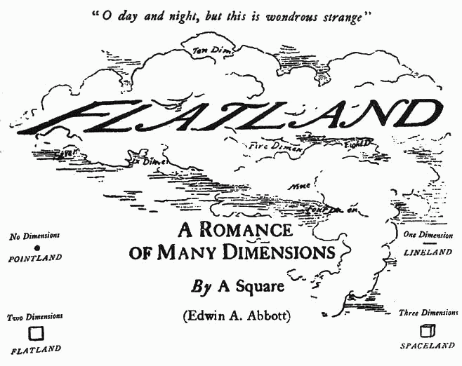

# Flatland {#english}

I call our world Flatland, not because we call it so, but to make its nature clearer to you, my happy readers, who are privileged to live in Space.

Imagine a vast sheet of paper on which straight Lines, Triangles, Squares, Pentagons, Hexagons, and other figures, instead of remaining fixed in their places, move freely about, on or in the surface, but without the power of rising above or sinking below it, very much like shadows—only hard and with luminous edges—and you will then have a pretty correct notion of my country and countrymen.
Alas, a few years ago, I should have said "my universe": but now my mind has been opened to higher views of things.

In such a country, you will perceive at once that it is impossible that there should be anything of what you call a "solid" kind; but I dare say you will suppose that we could at least distinguish by sight the Triangles, Squares, and other figures, moving about as I have described them.
On the contrary, we could see nothing of the kind, not at least so as to distinguish one figure from another.
Nothing was visible, nor could be visible, to us, except Straight Lines; and the necessity of this I will speedily demonstrate.

Place a penny on the middle of one of your tables in Space; and leaning over it, look down upon it.
It will appear a circle.

But now, drawing back to the edge of the table, gradually lower your eye (thus bringing yourself more and more into the condition of the inhabitants of Flatland), and you will find the penny becoming more and more oval to your view, and at last when you have placed your eye exactly on the edge of the table (so that you are, as it were, actually a Flatlander) the penny will then have ceased to appear oval at all, and will have become, so far as you can see, a straight line.

The same thing would happen if you were to treat in the same way a Triangle, or Square, or any other figure cut out of pasteboard.
As soon as you look at it with your eye on the edge on the table, you will find that it ceases to appear to you a figure, and that it becomes in appearance a straight line.
Take for example an equilateral Triangle—who represents with us a Tradesman of the respectable class.
Fig. 1 represents the Tradesman as you would see him while you were bending over him from above; figs. 2 and 3 represent the Tradesman, as you would see him if your eye were close to the level, or all but on the level of the table; and if your eye were quite on the level of the table (and that is how we see him in Flatland) you would see nothing but a straight line.

When I was in Spaceland I heard that your sailors have very similar experiences while they traverse your seas and discern some distant island or coast lying on the horizon.
The far-off land may have bays, forelands, angles in and out to any number and extent; yet at a distance you see none of these (unless indeed your sun shines bright upon them revealing the projections and retirements by means of light and shade), nothing but a grey unbroken line upon the water.

Well, that is just what we see when one of our triangular or other acquaintances comes toward us in Flatland.
As there is neither sun with us, nor any light of such a kind as to make shadows, we have none of the helps to the sight that you have in Spaceland.
If our friend comes closer to us we see his line becomes larger; if he leaves us it becomes smaller: but still he looks like a straight line; be he a Triangle, Square, Pentagon, Hexagon, Circle, what you will—a straight Line he looks and nothing else.

You may perhaps ask how under these disadvantageous circumstances we are able to distinguish our friends from one another: but the answer to this very natural question will be more fitly and easily given when I come to describe the inhabitants of Flatland.
For the present let me defer this subject, and say a word or two about the climate and houses in our country.

# Kinyarwanda Name {#kinyarwanda}

Add Kinyarwanda text.

# Quiz {#quiz}
