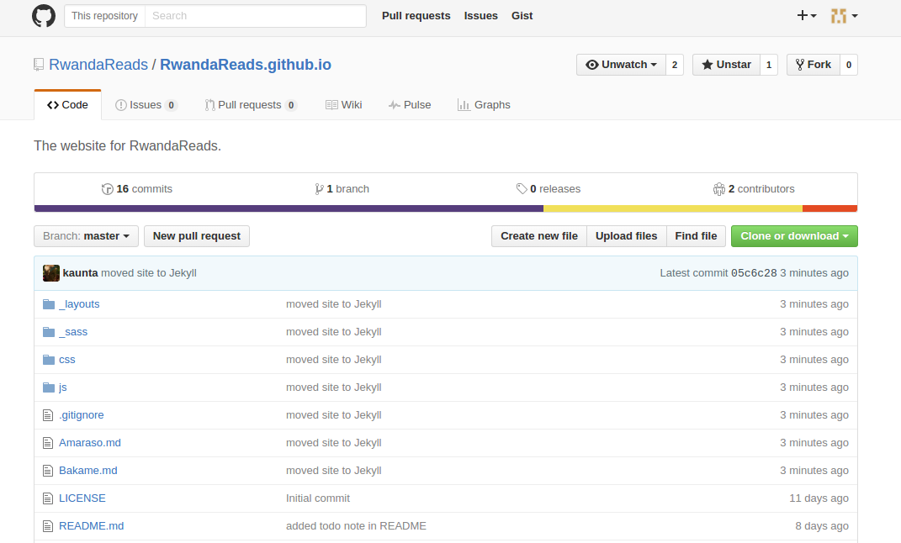
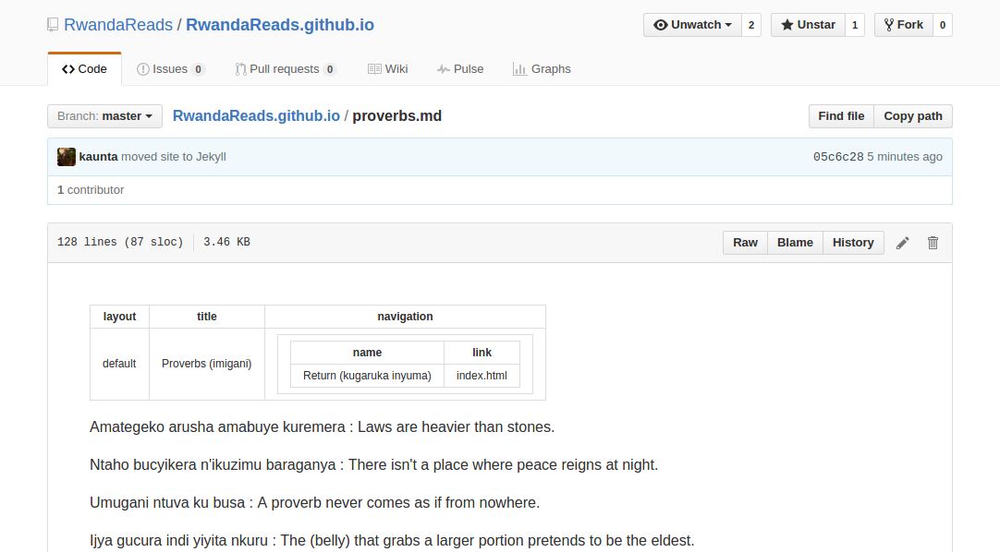
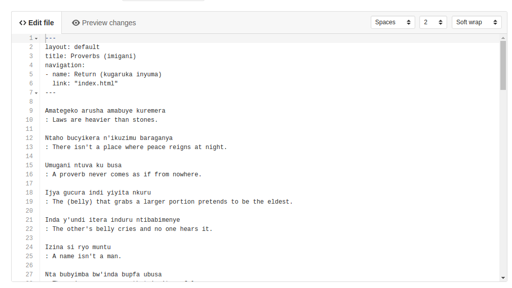
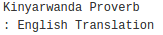
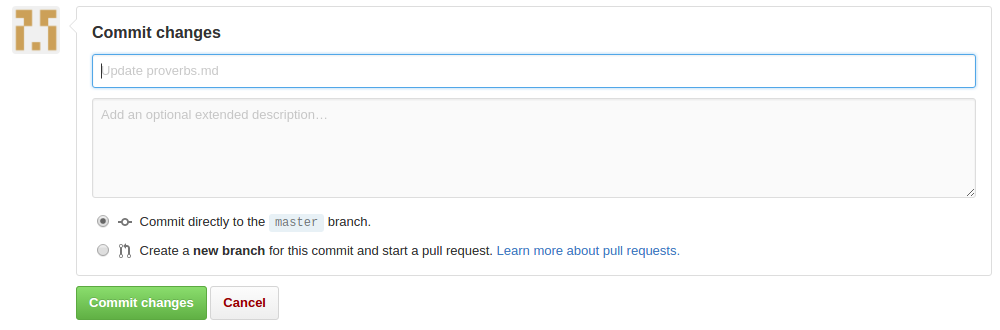
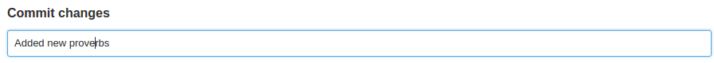

# Rwanda Reads

This is the website for Rwanda Reads.
If you want to help, email <YesRwandaReads@gmail.com>.

# How to Add Proverbs

1. Make sure you are at the Project's main view.

2. Find the file called `proverbs.md` and click on it.

3. You should see a view of the proverbs file.

4. Click on the edit button (shaped like a pencil) in the top right corner.

5. You should have a version of the file you can type in.

6. Type your proverb into the file.

7. Below the file, you should see a box that says "Commit Changes."

8. In the first text box, type a small message about the work you did.

9. Click the green "Commit Changes" button.

10. You've added proverbs! Congratulations.
