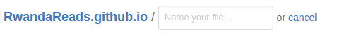

# Rwanda Reads

This is the website for Rwanda Reads.
If you want to help, email <YesRwandaReads@gmail.com>.


# General Information

## How to create a file

1. Hit the "Create File" button above the list of files. 
2. Type the name of the file into the top text box. 
3. Type the contents of the file in the below text box.
4. Commit the changes.

## How to edit a file

Let's say we want to edit the file `proverbs.md`.
Make sure you are at the Project's main view.


Find `proverbs.md` and click on it.


You should see a view of the file.


Click on the edit button (shaped like a pencil) in the top right corner.


You should have a version of the file you can type in.


Type your changes into the file.


Below the file, find the "Commit Changes" box.


In the first text box, type a small message about the work you did.


Click the green "Commit Changes" button.


You've edited the file!

## How to remove a file

1. Click on the file you want to delete.
2. Click on the trashcan icon in the top right corner. 
3. Commit the changes.

# Proverbs

## How to add a proverb

1. Open the file `proverbs.md` for editing.
2. Type your proverb in where you want.
3. Commit the changes. (See "How to edit a file")

## How to change a proverb

1. Open the file `proverbs.md` for editing.
2. Find the proverb you want to change.
3. Change the proverb.
4. Commit the changes. (See "How to edit a file")

## How to remove a proverb

1. Open the file `proverbs.md` for editing.
2. Find the proverb you want to delete.
3. Delete it.
4. Commit the changes. (See "How to edit a file")

# Stories

## How to add a story

1. Create a file called `XXX.md` where `XXX` is the name of your story. (See "How to create a file")
   For example: `Amaraso.md`, `Bakame.md`.
2. Copy the the story template into the file.
3. Add in the story's name in Kinyarwanda and English.
4. Add the English and Kinyarwanda versions of the stories.
   **Make sure that there is a blank line between paragraphs!**
5. Commit the changes. (See "How to edit a file")
6. Open the file `stories.md` for editing.
7. Pick one of the story levels: "Beginner", "Intermediate", or "Advanced".
8. Copy the story description template into the file.
9. Fill in the name of the story and the name of the file.
   **Here, type `XXX.html`, not `XXX.md`.**
10. Fill in the English and Kinyarwanda descriptions of the story.
11. Commit the changes. (See "How to edit a file")

## How to edit a story

1. Open the file of the story you want to edit.
   For example: `Amaraso.md`, `Bakame.md`.
2. Type your changes into the file.
3. Commit the changes. (See "How to edit a file")

## How to remove a story

1. Remove the story file. (See "How to remove a file")
   For example: `Amaraso.md`, `Bakame.md`.
2. Open the file `stories.md` for editing.
3. Remove the name and the description of the story from the file.
4. Commit the changes. (See "How to edit a file")

# Story Template

```
---
layout: default
title: English Story Name (Kinyarwanda Story Name)
navigation:
- name: Return (kugaruka inyuma)
  link: "stories.html"
- name: English (icyongereza)
  link: "#english"
- name: Kinyarwanda (ikinyarwanda)
  link: "#kinayrwanda"
- name: Quiz (ikizamini)
  link: "#quiz"
---

# English Story Name {#english}

The story in English.

# Kinyarwanda Story Name {#kinyarwanda}

The story in Kinyarwanda.

# Quiz (ikizamini) {#quiz}

1. First quiz question.
2. Second quiz question.
3. And the rest...

----

1. Answer to the first question.
2. Answer to the second question.
3. And the rest...
```

# Story Description Template

```
[English Story Name (Kinyarwanda Story Name)](StoryFile.html)
: English description of the story.
: Kinyarwanda description of the story.
```

# FAQ

Questions will be put here as they arise.
